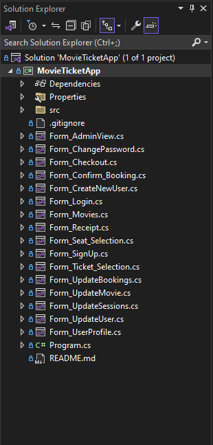

# [32998] .NET Application Development

## Assignment 2 - Group Project

#### Students: 

- #### Emily Deng, 14087896

- #### Victor Patterson Zottmann, 14226207

## How to run the program

To run the program, it is necessary that you are using **Visual Studio IDE** on **Windows** and have `.NET 6.0` installed.

- **Clone this repository**
- **Navigate to `.\bin\Debug\net6.0-windows\MovieTicketApp.exe`** and run the executable file

### Alternative:

In case you would like to run the program within Visual Studio IDE:

- **Open the solution in Visual Studio (make sure that the solution explorer looks like this**

  

- **Click on the play icon to run it**

## Login Credentials (Seeded)

The system only contains two types of users: Users (Normal) and Admin. There are currently a few credentials for each user seeded in `./bin/Debug/net6.0-windows/login-credentials.txt`:

- **Users**:

  | Username | Password |
  | -------- | -------- |
  | parman   | pass     |
  | mbrophy  | pass     |
  | rpyett   | pass     |
  | pdudney  | Pass     |

- **Admin**

  | Username | Password |
  | -------- | -------- |
  | admin    | Pass     |

## List of Seeded Users

| User ID | Username | Password | First Name | Last Name |
| ------- | -------- | -------- | ---------- | --------- |
| 10002   | parman   | pass     | Paulie     | Arman     |
| 10003   | mbrophy  | pass     | Marty      | Brophy    |
| 10004   | rpyett   | pass     | Rubin      | Pyett     |
| 10005   | pdudney  | pass     | Peter      | Dudney    |
| 30000   | admin    | pass     | N/A        | N/A       |

